# LocalGPT Gen: Implementation Tracker & Dependency Graph

**Status:** Living document — update every session  
**Last updated:** 2026-03-21  
**Owner:** Yi

---

## How to Use This Document

1. Open this **first** every coding session
2. Check the Phase Dashboard for current status
3. Check the Blockers column for anything preventing progress
4. After each session, update Status, Actual effort, and Notes
5. Log every architectural decision in the Decision Log (Section 3)
6. When a risk materialises or is retired, update the Risk Register (Section 4)

---

## 1. Phase Dashboard

### Phase 1: Avatar, Physics & "Being There" (Weeks 1-3)

Target outcome: User generates a world via MCP tools → walks through it with WASD/mouse/jump/sprint → toggles fly mode.

| # | Deliverable | Status | Est | Actual | Owner | Blocked By | Notes |
|---|-------------|--------|-----|--------|-------|------------|-------|
| 1.1 | **Avian 0.6 integration** | ✅ DONE | 1d | 0.5d | Yi | — | Upgraded avian3d 0.5→0.6, bevy-tnua-avian3d 0.2→0.11. Fixed 16 API breaking changes (joint anchors, ExternalForce→Forces, TnuaController generics, SpatialQueryFilter borrow). Physics now DEFAULT enabled. 376 tests pass. |
| 1.2 | **bevy-tnua controller wiring** | ✅ DONE | 1d | 0.5d | Yi | — | bevy-tnua 0.30 API migrated: `PlayerScheme` enum with `TnuaScheme` derive, `desired_velocity`→`desired_motion`, action feeding via `initiate_action_feeding()`. Compiles clean. |
| 1.3 | **Player spawn via MCP** | ✅ DONE | 0.5d | 0.5d | Yi | — | Verified in-engine: `gen_spawn_player` → player appears, WASD moves, camera follows. Fixed: physics plugins registered, TnuaConfig inserted, PlayerCamera attached to main_camera. |
| 1.4 | **Camera follow + spring arm** | ✅ DONE | 0.5d | 0.25d | Yi | — | Verified in-engine: mouse rotates camera, spring arm collision avoidance works. V key toggles ThirdPerson↔FirstPerson with smooth blend. |
| 1.5 | **Avatar ↔ Player unification** | ✅ DONE | 2d | 0.5d | Yi | — | Legacy avatar removed. Two-mode CameraMode (FreeFly/Player). Tab toggles. `gen_spawn_player` auto-switches to Player mode. |
| 1.6 | **Fly/noclip mode** | ✅ DONE | — | 0.25d | — | — | FreeFly (Tab), Noclip (N key): removes physics components, 6DOF flight, Space/Shift for up/down. Toast notification shows state. |
| 1.7 | **Sprint** | ✅ DONE | 0.5d | — | Yi | — | Verified in-engine: Shift key increases movement speed. Disabled in noclip (Shift used for down). |
| 1.8 | **Collision with world geometry** | ✅ DONE | 2d | 0.5d | Yi | — | `auto_collider_system`: maps all 11 ParametricShape variants to Avian colliders. `gltf_mesh_collider_system`: trimesh from loaded glTF meshes. Ground plane gets ParametricShape→collider. All spawn paths covered. |
| 1.9 | **Spawn point + respawn** | ✅ EXISTS | 0.5d | — | — | — | `respawn_player_system` already existed: y < -50 → teleport to default SpawnPoint. `KillPlane` resource with configurable y_level. `enforce_single_default_system` ensures one default. |
| 1.10 | **Input system integration** | ✅ DONE | 0.5d | 0.25d | Yi | — | Player input systems gated with `in_player_mode` run condition. Avatar systems gated with `in_attached_mode`. FreeFly gated with `in_freefly_mode`. No input conflicts between modes. |

**Phase 1 status key:**
- 🔍 AUDIT = Code exists, needs testing/verification in-engine
- ⚠️ TODO = Requires new implementation
- 🚧 IN PROGRESS = Actively being worked on
- ✅ EXISTS = Already working (pre-existing)
- ✅ DONE = Implemented and verified compiling in this session
- 🚫 BLOCKED = Cannot proceed until dependency is resolved

**Phase 1: COMPLETE.** All 10 deliverables done and verified in-engine.

---

### Phase 2: Interaction, Triggers & Ambient Audio (Weeks 4-7)

Target outcome: Worlds have interactive objects (doors, collectibles, switches), ambient sound auto-plays, footsteps work, vegetation sways, particles drift.

| # | Deliverable | Status | Est | Actual | Blocked By | Notes |
|---|-------------|--------|-----|--------|------------|-------|
| 2.1 | **Trigger volume system** | ✅ DONE | 2d | — | — | 6 trigger types (proximity, click, timer, area, collision-scaffolded, once). 10 action types. 12+ systems all active. 14 MCP tools registered. |
| 2.2 | **Door interaction** | ✅ DONE | 1d | — | — | State machine (Closed→Opening→Open→Closing). Proximity + click activation. `requires_key` checks PlayerInventory. Auto-close with delay. |
| 2.3 | **Collectible system** | ✅ DONE | 1d | — | — | Pickup → score → despawn/respawn. Sparkle/dissolve effects. Key items auto-added to PlayerInventory. |
| 2.4 | **Teleporter** | ✅ DONE | 0.5d | — | — | Fade/particle effects. 3-phase teleport (fade in→teleport→fade out). |
| 2.5 | **Entity event wiring** | ✅ DONE | 1d | — | — | `gen_link_entities` with source_event→target_action. TriggerFired events propagated. |
| 2.6 | **Procedural ambient audio** | ✅ DONE | 3d | — | — | 7 procedural soundscapes via FunDSP (wind, rain, forest, ocean, cave, stream, silence). No file assets needed — all synthesized. Auto-inference from entity names. |
| 2.7 | **Sound on triggers** | ✅ DONE | 1d | 0.25d | — | PlaySoundAction wired in proximity + click trigger systems. AudioEngine::play_emitter_at() spawns one-shot emitters. |
| 2.8 | **Wind/vegetation shader** | ⚠️ DEFER | 2d | | — | Deferred to Phase 3 polish. Vertex displacement shader needs custom Bevy material. |
| 2.9 | **Water animation** | ✅ DONE | 1d | — | — | WaterPlugin registered. WaterParams defined with wave parameters. |
| 2.10 | **Particle effects** | ⚠️ DEFER | 2d | | — | Deferred. Sparkle/dissolve effects exist for collectibles. Full particle system (dust, fireflies, fog) deferred. |
| 2.11 | **Flickering lights** | ⚠️ DEFER | 0.5d | | — | Deferred. Can be added as a behavior type. |
| 2.12 | **In-world signs/labels** | ✅ DONE | 1d | — | — | SignPlugin (billboard), LabelPlugin (floating nameplates), TooltipPlugin, NotificationPlugin. All functional with MCP tools. |
| 2.13 | **HUD system** | ✅ DONE | 1d | — | — | Score, health, timer, text elements. 6 position presets. Score synced from trigger ScoreBoard. Click prompts render via ClickPromptText. |
| 2.14 | **Dialogue UI shell** | ✅ DONE | 1d | — | — | DialoguePlugin registered. Dialogue nodes with choices. UI rendering functional. |

**Phase 2 summary:** 11 of 14 deliverables DONE. 3 deferred (wind shader, particles, flickering lights) — cosmetic polish, not functional gaps.

---

### Phase 3: Publish, Templates & Gallery (Weeks 8-12)

Target outcome: Users can publish worlds to shareable URLs, browse a gallery, fork/remix other worlds, start from templates, and go from zero to published world in 60 seconds.

| # | Deliverable | Status | Est | Actual | Blocked By | Notes |
|---|-------------|--------|-----|--------|------------|-------|
| 3.1 | **World export** | ✅ DONE | 2d | — | — | RON save/load (full state), glTF/GLB (PBR materials), HTML/Three.js (self-contained viewer with audio + behaviors + OG tags). Round-trip verified. |
| 3.2 | **Web viewer** | ✅ DONE | 5d | — | — | `gen_export_html` IS the web viewer. Self-contained Three.js with PBR, audio, behaviors, OrbitControls. No separate web app needed. |
| 3.3 | **Publish pipeline** | ⚠️ TODO | 3d | | — | Need: upload HTML+thumbnail to static hosting (R2/S3), return URL. `gen_publish_world` MCP tool not yet implemented. |
| 3.4 | **OG share cards** | ✅ DONE | 1d | — | — | Scaffolded in HTML export — og:title, og:description, og:image meta tags included. |
| 3.5 | **Gallery UI** | ✅ DONE | 2d | — | — | egui overlay (G key), search/filter, thumbnails, load button. Works as local browser. No web gallery yet. |
| 3.6 | **Starter templates** | ⚠️ TODO | 5d | | — | 0 templates exist. Need 5 curated worlds as skill directories. |
| 3.7 | **Remix/fork** | ✅ DONE | 2d | 0.5d | — | `gen_fork_world` copies world directory with attribution. |
| 3.8 | **Onboarding flow** | ⚠️ TODO | 2d | | 3.6 | Theme selection → generate → customize → publish. Needs templates first. |
| 3.9 | **Terrain primitives** | ✅ DONE | 2d | — | — | gen_add_terrain (Perlin/Simplex heightmap), auto-collider via ParametricShape. Needs in-engine visual test. |
| 3.10 | **Water primitives** | ✅ DONE | 1d | — | — | WaterPlugin + gen_add_water. Needs in-engine visual test. |
| 3.11 | **Path/road system** | ✅ DONE | 1d | — | — | PathPlugin + gen_add_path. Needs in-engine visual test. |
| 3.12 | **Foliage scatter** | ✅ DONE | 1d | — | — | FoliagePlugin + gen_add_foliage (Poisson disk). Needs in-engine visual test. |

**Phase 3 summary:** 8 of 12 deliverables DONE. 3 TODO (publish pipeline, templates, onboarding). Key insight: HTML export IS the web viewer — no separate Three.js app needed.

---

### Phase 4: AI NPCs & Advanced Audio (Weeks 13-20+)

Target outcome: NPCs with LLM-driven dialogue, behavior trees, procedural animation, AI-generated contextual audio, day/night cycle, weather.

| # | Deliverable | Status | Est | Actual | Blocked By | Notes |
|---|-------------|--------|-----|--------|------------|-------|
| 4.1 | **Local LLM integration** | ⚠️ TODO | 3d | | — | `llama-cpp-2` crate for Nemotron-Mini-4B or Llama 3.2 3B. System prompt per NPC. |
| 4.2 | **NPC dialogue via LLM** | ⚠️ TODO | 3d | | 4.1, 2.14 | Connect LLM output → dialogue UI. Per-NPC memory. Action extraction. |
| 4.3 | **Behavior trees/Utility AI** | ⚠️ TODO | 3d | | — | Evaluate big-brain vs bevy_behave. Pre-built templates: idle, patrol, wander, guard. |
| 4.4 | **NPC patrol existing** | 🔍 AUDIT | 1d | | — | `gen_add_npc` with `behavior: patrol` + `patrol_points` exists. Need to verify: NPC actually moves along waypoints |
| 4.5 | **Procedural IK animation** | ⚠️ TODO | 3d | | — | `bevy_mod_inverse_kinematics` for foot placement. Procedural idle (breathing, weight shift). |
| 4.6 | **AI music generation** | ⚠️ TODO | 3d | | — | ACE-Step v1.5 as localhost microservice. Content-addressed cache. |
| 4.7 | **AI SFX generation** | ⚠️ TODO | 2d | | — | Stable Audio Open for SFX. Provider fallback: local → cloud → stock. |
| 4.8 | **AI voice synthesis** | ⚠️ TODO | 2d | | — | Sesame CSM-1B or ElevenLabs for NPC voices. |
| 4.9 | **Contextual auto-audio** | ⚠️ TODO | 3d | | 4.6, 4.7, 2.6 | Drop a forest → forest sounds auto-generate. Scene analysis → audio requirements. |
| 4.10 | **Day/night cycle** | ⚠️ TODO | 2d | | — | Sun position → directional light angle + color temp. Skybox transitions. |
| 4.11 | **Weather system** | ⚠️ TODO | 3d | | 2.10, 4.10 | Clear/cloudy/rain/fog/snow states. Particles + post-processing + audio per state. |

---

## 2. Dependency Graph

```mermaid
graph TD
    subgraph Phase1["Phase 1: Avatar & Physics"]
        A1[1.1 Avian 0.6 integration]
        A2[1.2 bevy-tnua wiring]
        A3[1.3 Player spawn via MCP]
        A4[1.4 Camera follow + spring arm]
        A5[1.5 Avatar ↔ Player unification]
        A6[1.6 Fly/noclip ✅]
        A7[1.7 Sprint]
        A8[1.8 Collision with world geometry]
        A9[1.9 Spawn point + respawn]
        A10[1.10 Input system]

        A1 --> A2
        A2 --> A3
        A3 --> A4
        A3 --> A5
        A3 --> A7
        A3 --> A9
        A3 --> A10
        A1 --> A8
    end

    subgraph Phase2["Phase 2: Interaction & Ambient"]
        B1[2.1 Trigger volumes]
        B2[2.2 Doors]
        B3[2.3 Collectibles]
        B4[2.4 Teleporters]
        B5[2.5 Entity event wiring]
        B6[2.6 Stock ambient audio]
        B7[2.7 Footstep SFX]
        B8[2.8 Wind shader]
        B9[2.9 Water animation]
        B10[2.10 Particles]
        B11[2.11 Flickering lights]
        B12[2.12 Signs/labels]
        B13[2.13 HUD]
        B14[2.14 Dialogue UI shell]

        A1 --> B1
        A3 --> B4
        A3 --> B7
        B1 --> B2
        B1 --> B3
        B1 --> B4
        B1 --> B5
    end

    subgraph Phase3["Phase 3: Publish & Templates"]
        C1[3.1 World export]
        C2[3.2 Web viewer]
        C3[3.3 Publish pipeline]
        C4[3.4 OG share cards]
        C5[3.5 Gallery UI]
        C6[3.6 10 templates]
        C7[3.7 Remix/fork]
        C8[3.8 Onboarding]
        C9[3.9 Terrain]
        C10[3.10 Water]
        C11[3.11 Paths]
        C12[3.12 Foliage]

        C1 --> C2
        C2 --> C3
        C3 --> C4
        C1 --> C7
        A1 --> C9
        C9 --> C11
        C9 --> C12
    end

    subgraph Phase4["Phase 4: AI NPCs & Audio"]
        D1[4.1 Local LLM]
        D2[4.2 NPC dialogue via LLM]
        D3[4.3 Behavior trees]
        D4[4.4 NPC patrol]
        D5[4.5 Procedural IK]
        D6[4.6 AI music gen]
        D7[4.7 AI SFX gen]
        D8[4.8 AI voice]
        D9[4.9 Contextual auto-audio]
        D10[4.10 Day/night]
        D11[4.11 Weather]

        D1 --> D2
        B14 --> D2
        D6 --> D9
        D7 --> D9
        B6 --> D9
        B10 --> D11
        D10 --> D11
    end
```



---

## 3. Decision Log

| Date | Decision | Chose | Over | Why |
|------|----------|-------|------|-----|
| 2026-03-21 | Document generation strategy | 7 docs, JIT generation | Generate all 7 upfront | Phase specs depend on decisions made during earlier phases |
| | First coding session approach | Build audit (enable physics, compile, test) | Start implementing new features | Codebase has more scaffolding than expected — need to know actual state |
| 2026-03-22 | Avian version pin | **Avian 0.6 crates.io** | Avian 0.5 | 0.6 released 2026-03-16 on crates.io. bevy-tnua-avian3d 0.11 shipped same day with full support. All target Bevy 0.18. |
| 2026-03-22 | Default build: physics | **ON by default** | OFF (opt-in) | Gen mode needs physics for player, colliders, triggers. Non-physics path is degraded experience. |
| 2026-03-22 | Character controller crate | **bevy-tnua 0.30** | bevy_ahoy, custom | tnua already in codebase, 0.30 supports Avian 0.6 via bevy-tnua-avian3d 0.11. Mature, serializable configs. |
| 2026-03-22 | Avatar/Player unification | **Three-mode CameraMode** (Option A+) | Merge into single system | Keep both systems. Gate with run conditions. `CameraMode::Player` for physics char, `Attached` for avatar, `FreeFly` for spectator. Tab cycles. Minimal code churn, maximum flexibility. |
| 2026-03-22 | Auto-collider approach | **Reactive system** (`Added<ParametricShape>`) | Inline in spawn functions | Follows existing terrain pattern. Single insertion point covers all spawn paths. glTF gets separate trimesh system. |

### Pending Decisions

| Decision | Options | Factors | Target Date |
|----------|---------|---------|-------------|
| Noclip toggle (N key) | (A) Disable Avian collision on player. (B) Switch to FreeFly temporarily. | N key currently unmapped. Need to decide if noclip is transform-based or physics-based. | Phase 1 in-engine test |

---

## 4. Risk Register

| # | Risk | Severity | Likelihood | Status | Mitigation |
|---|------|----------|------------|--------|------------|
| R1 | Avian 0.6 not compatible with current bevy-tnua version | High | Medium | ✅ RETIRED | bevy-tnua-avian3d 0.11 released same day as Avian 0.6. Full compatibility confirmed. 376 tests pass. |
| R2 | Two avatar systems create conflicting input/camera handling | High | High | ✅ RETIRED | Three-mode CameraMode with exclusive run conditions. Player systems only run in Player mode. Zero input conflicts. |
| R3 | Generated primitives lack colliders → player falls through world | High | Medium | ✅ RETIRED | `auto_collider_system` for ParametricShape (11 variants). `gltf_mesh_collider_system` for loaded meshes. Ground plane has ParametricShape. All paths covered. |
| R4 | Bevy version mismatch between plugins | Medium | Medium | ✅ RETIRED | avian3d 0.6, bevy-tnua 0.30, bevy-tnua-avian3d 0.11, bevy_egui 0.39 — all target Bevy 0.18. Clean compile. |
| R5 | Terrain height estimation inaccurate → objects float or sink | Medium | High | KNOWN | No `query_terrain_height(x,z)` tool. Manual Y offset estimation. Workaround: spawn high + gravity drop. `QueryTerrainHeight` command already in commands.rs. |
| R6 | Audio assets not CC0 compliant → legal risk for distribution | Medium | Low | OPEN | Verify every asset from freesound.org. Document license per file. |
| R7 | Web viewer (Three.js) can't faithfully reproduce Bevy materials | Medium | Medium | OPEN | PBR mapping is standard. Custom shaders (wind, water) need Three.js equivalents. |
| R8 | bevy_hanabi particles incompatible with current Bevy version | Low | Medium | OPEN | Check version. Fallback: manual particle system with instanced meshes. |

---

## 5. Session Log

Track what happened each session. This is the journal that prevents losing context between coding days.

### Session Template

```
### YYYY-MM-DD — Session N

**Goal:** What I planned to work on
**Accomplished:**
- [ ] Item 1
- [ ] Item 2

**Decisions made:**
- Decision X: chose Y because Z

**Blockers discovered:**
- Blocker description

**Next session plan:**
- First thing to do
- Second thing to do
```

### 2026-03-21 — Session 0 (Planning)

**Goal:** Create implementation tracker and Phase 1 RFC
**Accomplished:**
- [x] Reviewed full codebase via project knowledge search
- [x] Discovered extensive P1-P5 scaffolding already in place
- [x] Created Doc 0 (this document)
- [x] Created Doc 1 (RFC-Avatar-Physics-Integration)

**Key discovery:** Codebase has dual avatar/player systems, full MCP tool handlers, physics behind feature flag, spring-arm camera with collision avoidance. Much more built out than research docs implied.

**Decisions made:**
- First coding session = build audit, not greenfield implementation

**Next session plan:**
1. Enable `physics` feature flag, attempt full compile
2. Run gen mode, call `gen_spawn_player` via MCP, observe what happens
3. Resolve avatar.rs ↔ player.rs conflict (Decision: unification approach)
4. Test collision: spawn primitives, walk into them

### 2026-03-21 — Session 1 (State Reconciliation)

**Goal:** Reconcile Doc 0 with actual codebase completion status, prepare for Phase 1 build audit

**Key discovery:** Cross-referencing `docs/world/gap/TODO-START.md` reveals far more completion than Doc 0 reflects:
- **World gap specs**: 76 of 83 specs DONE (92%), 7 scaffolded (awaiting external services)
- **P0 Inspector**: 8/8 DONE — toggle, outliner tree, detail panel, world info, 3D selection, WebSocket, SwiftUI, Android
- **P1 Avatar**: 5/5 tools DONE — `gen_spawn_player`, `gen_set_spawn_point`, `gen_add_npc`, `gen_set_npc_dialogue`, `gen_set_camera_mode`
- **P2 Interaction**: 5/5 tools DONE — `gen_add_trigger`, `gen_add_teleporter`, `gen_add_collectible`, `gen_add_door`, `gen_link_entities`
- **P3 Terrain**: 5/5 tools DONE + bonus `gen_query_terrain_height`
- **P4 UI**: 5/5 tools DONE — sign, hud, label, tooltip, notification
- **P5 Physics**: 5/5 tools DONE — physics, collider, joint, force, gravity
- **Runtime Gaps**: 24/24 ALL DONE — MCP tool components now have full Bevy runtime systems
- **WG1-WG7**: ALL DONE — blockout, navmesh, hierarchical placement, evaluation, editing, decomposition, depth preview
- **Headless pipeline**: 25/31 specs DONE (81%), 6 remaining need live integration

**Reframing Phase 1:** Given this, Phase 1 is NOT "implement avatar/physics." It is:
1. **Verify** that existing P1/P5 scaffolding compiles and runs with physics feature
2. **Unify** the dual avatar.rs / player.rs systems (Doc 1, Section 2)
3. **Wire up** collider auto-insertion on spawned geometry
4. **Polish** movement feel (Tnua config, camera smoothing)

**Parallel workstream — Headless completion:**
6 remaining headless specs (H1.5.2 offscreen camera, H1.5.4-5 screenshot pipeline, H2.5 heartbeat dispatch, H3.5-6 memory, H4.4 thumbnails, H5.5 experiment processor) should be tracked alongside Phase 1.

**Parallel workstream — Long-term architecture:**
Four goal documents in `todo-gen/goal/` define the multi-year vision:
- MMO-scale spatial sharding via SpacetimeDB (BitCraft pattern)
- Multi-scale universe (planetary to galactic via `big_space`)
- Governance, permissions, content quality scoring
- AI ecosystems, time archaeology, emergent civilizations
These inform but don't block Phase 1-4. Current phased approach correctly builds the foundation.

**Decisions made:**
- Doc 0 Phase 1 status reframed from "implement" to "verify + unify + wire + polish"
- Headless pipeline tracked as parallel workstream
- Goal docs reviewed — no changes needed to Phase 1-4 plan

**Next session plan:**
1. Build audit: `cargo build --features physics` in localgpt
2. Agent teams: avatar/player code audit, physics feature audit, collision audit

### 2026-03-22 — Session 2 (Implementation Sprint)

**Goal:** Execute Phase 1 build audit, upgrade physics, add colliders, unify avatar/player systems

**Accomplished:**
- [x] Upgraded avian3d 0.5→0.6, bevy-tnua-avian3d 0.2→0.11 (all target Bevy 0.18)
- [x] Fixed 16 avian3d/bevy-tnua API breaking changes across 5 files
- [x] Enabled physics feature by default (`default = ["physics"]`)
- [x] Added `auto_collider_system` — reactive system mapping 11 ParametricShape variants to Avian colliders
- [x] Added `gltf_mesh_collider_system` — trimesh colliders for loaded glTF meshes
- [x] Added ParametricShape to ground plane for auto-collider
- [x] Exposed 5 physics MCP tools: `gen_set_physics`, `gen_add_collider`, `gen_add_joint`, `gen_add_force`, `gen_set_gravity`
- [x] Implemented three-mode CameraMode (FreeFly/Attached/Player) with exclusive run conditions
- [x] Gated PlayerPlugin and CameraPlugin with `in_player_mode` run condition
- [x] `gen_spawn_player` now auto-switches to Player mode
- [x] Tab key correctly cycles Player↔FreeFly (prefers Player over Attached when player exists)
- [x] Verified: 376 tests pass, zero compile errors, zero warnings in changed files
- [x] Confirmed `respawn_player_system` already exists (KillPlane y=-50, SpawnPoint lookup)
- [x] Updated Doc 0: Phase 1 dashboard (8/10 done), Decision Log (6 decisions), Risk Register (R1-R4 retired)

**Files changed (10):**
- `crates/gen/Cargo.toml` — deps + features
- `crates/gen/src/physics/collider.rs` — auto_collider_system, gltf_mesh_collider_system
- `crates/gen/src/physics/joint.rs` — avian3d 0.6 API migration
- `crates/gen/src/physics/force.rs` — ExternalForce→Forces
- `crates/gen/src/character/player.rs` — bevy-tnua 0.30 migration + in_player_mode gate
- `crates/gen/src/character/camera.rs` — SpatialQueryFilter borrow + in_player_mode gate
- `crates/gen/src/gen3d/avatar.rs` — CameraMode::Player variant, in_player_mode, Tab toggle update
- `crates/gen/src/gen3d/plugin.rs` — ground plane ParametricShape, SpawnPlayer→Player mode
- `crates/gen/src/gen3d/tools.rs` — 5 physics MCP tool implementations

**Risks retired:** R1 (Avian compat), R2 (avatar conflict), R3 (missing colliders), R4 (Bevy mismatch)

**Next session plan:**
1. In-engine test: `cargo run -p localgpt-gen`, call `gen_spawn_player` via MCP, verify player moves
2. In-engine test: spawn primitives, walk into them, verify collision
3. Polish movement feel: tune Tnua acceleration/deceleration, camera smoothing
4. Consider Phase 2 readiness: trigger volumes, ambient audio prep
