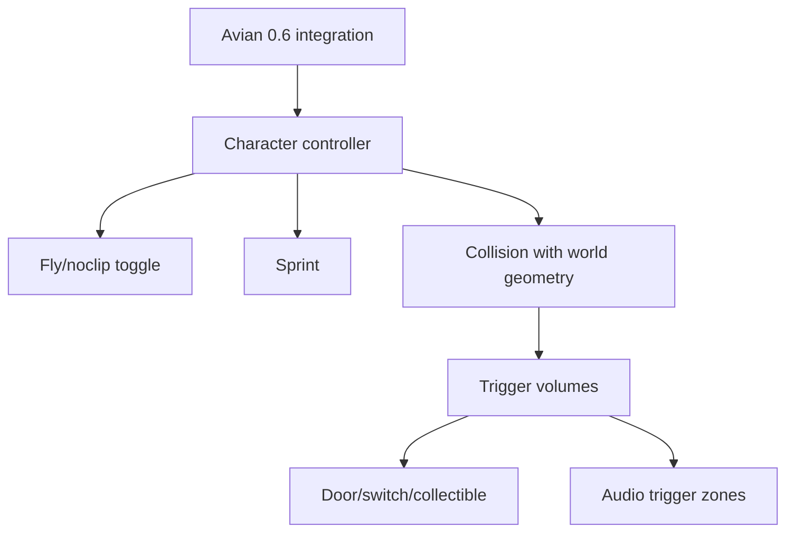

# LocalGPT Gen: Document Generation Plan

**Purpose:** Convert 627KB of research and RFCs into step-by-step implementation specs that a developer can follow sequentially without losing context or missing dependencies.

**Status:** Master plan  
**Date:** 2026-03-21  
**Prerequisite reading:** This document only. Each spec references its source research internally.

---

## The Problem With Your Current Doc Library

You have 25 documents organized by **topic** (audio, physics, architecture, SEO). None are organized by **execution sequence**. When you sit down to code on Monday morning, there's no single document that says "open this file, add this dependency, write this system, test it with this command, then move to the next thing."

The fix: **7 new documents** in 3 categories, generated in order. Each is self-contained — a developer who reads only that document can execute its phase completely.

---

## Document Map: What to Generate, In What Order

```
LAYER 1: Master Reference (generate first, update throughout)
  └── Doc 0: Implementation Tracker & Dependency Graph

LAYER 2: Phase Implementation Specs (generate one per phase, just before starting that phase)
  ├── Doc 1: RFC-Avatar-Physics-Integration (Phase 1)
  ├── Doc 2: RFC-Interaction-Triggers-Ambient-Audio (Phase 2)
  ├── Doc 3: RFC-Publishing-Templates-Gallery (Phase 3)
  └── Doc 4: RFC-AI-NPCs-Advanced-Audio (Phase 4)

LAYER 3: Cross-Cutting Specs (generate as needed)
  ├── Doc 5: MCP Tool Specification Registry
  └── Doc 6: World Template Authoring Guide
```

---

## Doc 0: Implementation Tracker & Dependency Graph

**Generate:** Immediately (before any coding)  
**Format:** Markdown with checkboxes and a Mermaid dependency diagram  
**Purpose:** The single source of truth for "what's done, what's next, what's blocked." Updated every session.  
**Length target:** ~3-4 pages, grows over time

### What It Must Contain

**Section 1 — Phase status dashboard:**
A table with every deliverable from all 4 phases, each with a status (not started / in progress / done / blocked), the estimated effort in days, actual days spent, and notes on blockers or decisions made. This is the document you open first every morning.

```
| Phase | Deliverable                    | Status      | Est | Actual | Notes              |
|-------|--------------------------------|-------------|-----|--------|--------------------|
| P1    | Avian 0.6 integration          | not started | 2d  |        |                    |
| P1    | Character controller (tnua)    | not started | 3d  |        | evaluate bevy_ahoy |
| P1    | Fly/noclip toggle              | not started | 1d  |        | depends on camera  |
| P1    | Sprint                         | not started | 0.5d|        |                    |
| P2    | Trigger/interaction system      | not started | 5d  |        |                    |
| P2    | Stock ambient audio library    | not started | 2d  |        |                    |
| ...   | ...                            | ...         | ... | ...    | ...                |
```

**Section 2 — Dependency graph (Mermaid):**
Shows which deliverables block which. Critical for knowing when you can parallelise and when you must serialise.



**Section 3 — Decision log:**
Every architectural decision made during implementation, with date, context, decision, and alternatives considered. This is the document future contributors read to understand *why* things are built the way they are.

```
| Date       | Decision                          | Chose             | Over              | Why                                      |
|------------|-----------------------------------|-------------------|-------------------|------------------------------------------|
| 2026-03-22 | Character controller crate        | bevy-tnua v0.30   | bevy_ahoy         | Serializable configs for MCP integration |
| 2026-03-25 | Physics engine version            | Avian 0.6 git     | Avian 0.5 crates  | Need move-and-slide primitives           |
```

**Section 4 — Known technical risks with mitigations:**
Pulled from existing RFCs but condensed to a quick-reference format. Updated as risks materialise or are retired.

### Source Research
- Prioritization report (this conversation)
- RFC-Headless-Gen-Experiment-Pipeline.md (risk tables)
- All phase specs below

---

## Doc 1: RFC-Avatar-Physics-Integration

**Generate:** Immediately after Doc 0  
**Format:** Full RFC (matching your existing RFC format: Status/Author/Date/Target crates/Depends on)  
**Purpose:** Step-by-step spec for Phase 1 — avatar control, physics, and the "being there" experience  
**Length target:** ~15-20 pages  
**Estimated implementation:** Weeks 1-3

### What It Must Contain

**1 — Summary (1 paragraph)**
One sentence of what this delivers: "After this RFC is implemented, a user can generate a world via MCP tools and immediately walk through it with WASD/mouse, jump, sprint, and toggle fly mode."

**2 — Cargo.toml changes (exact dependencies)**
List every new crate with exact version pins and feature flags. Pull from the research:
- `avian3d` — version, git rev if needed (0.6 just shipped March 16, may not be on crates.io yet)
- `bevy-tnua` + `bevy-tnua-avian3d` — version compatibility notes
- Any other new deps

**3 — Plugin registration changes**
You already have `PlayerPlugin`, `CameraPlugin`, `SpawnPointPlugin` registered in `plugin.rs`. This section specifies what each plugin must do, what components they register, and what systems they add. Structured as:

For each plugin:
- Components it owns (with full Rust struct definition)
- Systems it registers (with `SystemSet` ordering)
- Events it emits/observes
- MCP tools it exposes (name + parameter schema)

**4 — Character controller implementation (step-by-step)**

Step 4a: Avian 0.6 integration
- Add Avian plugin to app
- Configure physics timestep, gravity
- Test: spawn a cube with `RigidBody::Dynamic`, verify it falls

Step 4b: Player spawn system
- `gen_spawn_player` MCP tool implementation
- Component bundle: `PlayerBundle { transform, collider, tnua_controller, tnua_motor, camera, ... }`
- Default values for all parameters (walk_speed: 5.0, run_speed: 10.0, jump_force: 8.0, etc.)
- Camera setup: third-person follow with configurable distance, or first-person

Step 4c: Movement systems
- Input mapping (WASD + mouse look + space + shift)
- `TnuaBuiltinWalk` configuration with coyote time (0.15s) and jump buffering
- Sprint multiplier system
- Ground detection

Step 4d: Camera system
- Third-person camera with spring arm (collision avoidance against world geometry)
- First-person toggle (V key)
- Mouse sensitivity, inversion options
- Smooth interpolation (not raw transform copy)

Step 4e: Fly/noclip mode
- Toggle key (F or N)
- Disable gravity, disable collision
- 6DOF movement (WASD + space/ctrl for up/down)
- Speed multiplier (shift for fast fly)

Step 4f: Spawn point system
- `gen_set_spawn_point` MCP tool
- Default spawn at (0, 2, 0) if none set
- Respawn on fall-below-threshold (y < -50)

**5 — Collision integration with existing world geometry**
How generated primitives (boxes, spheres, meshes from `gen_add_primitive`) get colliders automatically. This is critical — every existing MCP tool that spawns geometry needs to also spawn a collider, or the player falls through the world.

Options to specify:
- Auto-collider from mesh (Avian's `Collider::trimesh_from_mesh`)
- Primitive colliders for known shapes
- Performance budget (max collider count before LOD kicks in)

**6 — Testing checklist**
Concrete test scenarios, not abstract acceptance criteria:
- [ ] Generate Willowmere Village → spawn player → walk on ground plane → no falling through
- [ ] Jump onto a `gen_add_primitive` box → land on top → no clipping
- [ ] Sprint across terrain → speed visibly faster than walk
- [ ] Toggle fly mode → rise above scene → look down → toggle back → fall with gravity
- [ ] Fall off edge → respawn at spawn point
- [ ] `gen_spawn_player` via MCP → player appears at specified position

**7 — Known gotchas and Bevy-specific pitfalls**
- Behavior anchor baking issue (already documented in your memory — `gen_add_behavior` anchors reference position at attachment time)
- Avian 0.6 is brand new — list known issues from the release blog
- bevy-tnua version compatibility with Avian 0.6 (may need git dep)
- Terrain height baseline estimation (no `query_terrain_height` tool yet)

### Source Research to Pull From
- `LocalGPT_Gen__Product_Design__Competitive_Intelligence__and_Growth_Playbook.md` — avatar tier analysis, MCP tool schemas for gen_spawn_player, gen_set_spawn_point, gen_add_npc
- `AI-Generated_3D_Worlds_in_Bevy__A_Full_Technology_Survey.md` — Bevy physics ecosystem, collision detection patterns
- `crates/gen/src/gen3d/plugin.rs` — existing plugin registration, what's already stubbed
- Prioritization report — Avian 0.6 release notes, bevy_ahoy, bevy-tnua details

---

## Doc 2: RFC-Interaction-Triggers-Ambient-Audio

**Generate:** When Phase 1 is complete (or nearly complete)  
**Format:** Full RFC  
**Purpose:** Step-by-step spec for Phase 2 — making worlds feel alive  
**Length target:** ~20-25 pages  
**Estimated implementation:** Weeks 4-7

### What It Must Contain

**1 — Trigger/interaction architecture**
The core system that everything else in this phase (and Phase 4) builds on.

Define the ECS pattern:
- `TriggerVolume` component (shape, radius, enter/exit events)
- `Interactable` component (click, proximity, or both)
- `StateMachine` component (states + transitions, serializable)
- Observer pattern: triggers emit `EntityEvent`s, observers react

Step-by-step implementation:
- Step 1: `TriggerVolume` component + overlap detection system using Avian sensor colliders
- Step 2: `OnTriggerEnter` / `OnTriggerExit` events
- Step 3: `Interactable` component + raycast-based click detection from player camera
- Step 4: `StateMachine` for entity state (open/closed, on/off, collected/not)
- Step 5: Pre-built interaction templates: Door, Switch, Collectible, Teleporter, Dialogue trigger, State toggle

MCP tools:
- `gen_add_trigger` — parameters, defaults
- `gen_add_door` — convenience wrapper
- `gen_add_collectible` — with counter/score tracking
- `gen_add_teleporter` — bidirectional, with destination entity_id
- `gen_add_switch` — with target entity_id and action (toggle, activate, deactivate)

**2 — Stock ambient audio system**
NOT the AI generation pipeline — a curated library of CC0/royalty-free ambient sounds that auto-play based on environment type.

Step-by-step:
- Step 1: Identify and bundle 30-50 CC0 ambient sounds (freesound.org sources, with license verification)
  - Categories: forest, cave, urban, indoor, water, wind, rain, night, dungeon
- Step 2: `AmbientZone` component with `environment_type` enum
- Step 3: Auto-assignment system: scan scene for terrain type, water presence, indoor/outdoor detection → assign ambient zones
- Step 4: Crossfade system between ambient zones as player moves
- Step 5: Footstep SFX system (3 surface types: stone, grass, wood — 3 variations each = 9 sounds)
- Step 6: UI sounds (hover, click, confirm, error — 4 sounds)

MCP tools:
- `gen_set_ambient` — override auto-detected ambiance for a zone
- `gen_add_sound_emitter` — positional sound source on any entity

**3 — Environmental animation**
What makes the world feel like it's running, not frozen:

- Wind shader on vegetation (grass, leaves, flags) — vertex displacement in custom material
- Water animation (scrolling normal maps on water planes)
- Particle effects: dust motes (indoor), fireflies (night/forest), fog wisps, ember sparks (fire)
- Flickering point lights (torches, candles) — simple sine wave + noise on light intensity
- Cloud shadow movement (scrolling shadow map)

Step-by-step for each, with specific Bevy shader/system code patterns.

**4 — In-world text and basic HUD**
- `gen_add_sign` — billboard text in world space (bevy_mod_billboard or custom)
- `gen_add_label` — floating text above entities
- Interaction prompt HUD ("Press E to open")
- Basic notification system ("Collected gold coin! 3/10")
- Dialogue box UI (for NPC conversations from Phase 4, but the UI shell ships now)

### Source Research to Pull From
- `LocalGPT_Gen__Product_Design__Competitive_Intelligence__and_Growth_Playbook.md` — interaction primitives, trigger system design, MCP tool schemas
- `Building_Audio_Generation_into_LocalGPT_Gen__Local-First_AI_Audio_Pipeline_for_Bevy.md` — Bevy audio ecosystem, bevy_kira_audio, runtime asset injection pattern
- `Rust_Audio_Synthesis_Meets_LLM-Driven_Scene_Generation_in_Bevy.md` — bevy_seedling, spatial audio
- `Designing_Selection_UX_for_AI-Driven_3D_Editing_in_Bevy.md` — click/raycast interaction patterns
- Prioritization report — ambient audio hierarchy, "alive world" factors

---

## Doc 3: RFC-Publishing-Templates-Gallery

**Generate:** When Phase 2 is ~75% complete  
**Format:** Full RFC  
**Purpose:** Step-by-step spec for Phase 3 — distribution, growth mechanics, onboarding  
**Length target:** ~15-20 pages  
**Estimated implementation:** Weeks 8-12

### What It Must Contain

**1 — One-click publish to shareable URL**
The technical path for making any world accessible via a web link.

Architecture decision: Three.js + Next.js viewer (already validated in `Three_js_wins_the_web_for_LocalGPT_Gen.md`) vs. Bevy WASM build.

Step-by-step:
- Step 1: World export format (ZIP with RON manifest + assets — already designed in `Designing_a_World_Package_Format_for_LocalGPT_Gen`)
- Step 2: Minimal web viewer that loads the world format and renders it
- Step 3: Static hosting strategy (GitHub Pages? Cloudflare Pages? S3?)
- Step 4: URL structure: `play.localgpt.app/worlds/{world_id}`
- Step 5: Auto-generated Open Graph meta tags (title, description, thumbnail) for social sharing
- Step 6: Embed code for iframes

MCP tool:
- `gen_publish_world` — export + upload + return shareable URL

**2 — Gallery and discovery**
- Gallery data model: world metadata (title, description, tags, thumbnail, creator, date, fork count, view count)
- Gallery UI: grid view with thumbnails, search, filter by tags
- Featured/trending/new tabs
- Integration with the existing `GalleryPlugin` (already registered in plugin.rs)

**3 — Template system**
- 10-20 starter world templates, each as a world package
- Template categories mapped to SEO keywords (from `SEO_Keyword_Strategy_for_LocalGPT_Gen_Starter_Worlds.md`)
- "Use this template" → loads world → user modifies via prompts
- Template metadata: name, description, tags, difficulty, preview images

Step-by-step for creating each template:
- Define scene spec (entities, positions, materials, lighting, ambient audio)
- Generate via MCP tools (document the exact tool calls)
- Test avatar walkthrough
- Capture thumbnails
- Package and register

**4 — Remix/fork mechanics**
- One-click fork: copies world package to user's workspace
- Auto-attribution: forked worlds link back to original
- Fork tree visualization (who forked whom)
- Remix counter on original world

**5 — Onboarding flow**
- First-run experience: theme selection → AI generation → customize → publish
- "Surprise me" random generation button
- Prompt suggestions with shuffle
- Progress indicator during generation
- Target: first complete world in 60 seconds

**6 — Terrain and landscape primitives**
These ship in Phase 3 because they're what makes templates diverse. A flat world with boxes is boring. Hills, valleys, rivers, and cliffs make each template feel unique.

- `gen_add_terrain` — heightmap-based terrain with parameters for size, resolution, height_scale, noise type
- `gen_add_water` — water plane with configurable height, color, transparency, wave animation
- `gen_add_path` — spline-based path/road on terrain
- `gen_add_foliage` — scatter vegetation on terrain with density, types, exclusion zones

### Source Research to Pull From
- `Three_js_wins_the_web_for_LocalGPT_Gen.md` — web viewer architecture
- `Designing_a_World_Package_Format_for_LocalGPT_Gen.md` — ZIP format, RON manifest
- `World_Packaging_Formats_for_AI-Driven_3D_Creation.md` — format analysis
- `SEO_Keyword_Strategy_for_LocalGPT_Gen_Starter_Worlds.md` — template categories, SEO architecture
- `LocalGPT_Gen__Product_Design__Competitive_Intelligence__and_Growth_Playbook.md` — growth loops, Canva template strategy, remix mechanics
- Prioritization report — blank canvas problem, onboarding patterns

---

## Doc 4: RFC-AI-NPCs-Advanced-Audio

**Generate:** When Phase 3 is complete  
**Format:** Full RFC  
**Purpose:** Step-by-step spec for Phase 4 — the "wow factor" features  
**Length target:** ~25-30 pages  
**Estimated implementation:** Weeks 13-20+

### What It Must Contain

**1 — Local LLM NPC dialogue system**
- Model selection: Nemotron-Mini-4B vs Llama 3.2 3B vs Phi-3-mini
- Integration: `llama-cpp-2` crate → GGUF model loading → inference
- Per-NPC system prompts: personality, backstory, knowledge boundaries
- Conversation memory: per-NPC message history with context window management
- Structured output: action extraction (say, emote, give_item, attack) via grammar constraints
- Response latency budget: < 500ms on consumer GPU

Step-by-step:
- Step 1: `llama-cpp-2` integration, model loading, basic inference
- Step 2: NPC personality template system (JSON persona definitions)
- Step 3: Dialogue UI integration (reuse dialogue box from Phase 2)
- Step 4: Per-NPC memory (conversation history, player relationship tracking)
- Step 5: Action extraction and execution (NPC can trigger game events based on dialogue)

**2 — NPC behavior system**
- Behavior tree or utility AI (evaluate `big-brain` vs `bevy_behave`)
- Pre-built behavior templates: idle, patrol, wander, follow, flee, guard
- State machines for NPC routines (day/night schedules)
- Pathfinding: `oxidized_navigation` for NavMesh generation from world geometry

MCP tools:
- `gen_set_npc_behavior` — assign behavior template + parameters
- `gen_set_npc_dialogue` — attach dialogue tree or LLM persona
- `gen_set_npc_schedule` — time-based behavior changes

**3 — Procedural animation**
- IK-based locomotion: `bevy_mod_inverse_kinematics` for foot placement
- Procedural idle animations (breathing, weight shifting, head tracking)
- Text-to-motion pipeline: HY-Motion 1.0 for offline animation generation
- Animation state machine: idle ↔ walk ↔ run ↔ jump transitions

**4 — AI-generated contextual audio**
This is where the deep audio research becomes actionable:
- ACE-Step v1.5 integration for music generation (localhost microservice)
- Stable Audio Open for SFX generation
- Sesame CSM-1B for NPC voice synthesis
- Glicol/FunDSP for procedural ambient textures

Architecture:
- Audio intent extraction: scene analysis → audio requirements (mood, environment type, time of day)
- Provider abstraction trait with fallback chain (local model → cloud API → stock library)
- Content-addressed cache (SHA256 of prompt → cached audio file)
- Spatial audio: `bevy_seedling` with HRTF for positional NPC voices

Step-by-step:
- Step 1: Audio intent schema (JSON describing what audio the scene needs)
- Step 2: Stock library fallback (always works, no AI needed)
- Step 3: Cloud API integration (ElevenLabs SFX + TTS as first backend)
- Step 4: Local model deployment (ACE-Step as localhost:8080 microservice)
- Step 5: Contextual auto-generation (drop a forest → forest sounds auto-generate)

**5 — Day/night cycle and weather**
- Sun position system (time-of-day → directional light angle + color temperature)
- Skybox transitions (day → sunset → night → dawn)
- Weather states: clear, cloudy, rain, fog, snow
- Weather particles and post-processing (rain drops, fog volume, snow accumulation)
- Audio integration: weather sounds tied to weather state

### Source Research to Pull From
- `Building_Audio_Generation_into_LocalGPT_Gen__Local-First_AI_Audio_Pipeline_for_Bevy.md` — full AI audio pipeline
- `Rust_Audio_Synthesis_Meets_LLM-Driven_Scene_Generation_in_Bevy.md` — Glicol, FunDSP, bevy_seedling
- `ABC_Notation_as_an_LLM-to-Audio_Bridge_for_Rust_and_Bevy__A_Strategic_Analysis.md` — LLM music generation
- `RFC-SpacetimeDB-3D-Audio-Data-Model.md` — audio data model for multiplayer
- `Reasoning-Enhanced_LLM_Inference__A_Rust_Builder_s_Guide.md` — constrained decoding for NPC output
- `LocalGPT_Gen__Product_Design__Competitive_Intelligence__and_Growth_Playbook.md` — NPC tool schemas
- Prioritization report — Nemotron-Mini-4B, bevy_behave, HY-Motion details

---

## Doc 5: MCP Tool Specification Registry

**Generate:** Alongside Doc 1, update continuously  
**Format:** Structured reference document (not an RFC)  
**Purpose:** Single source of truth for every MCP tool — current and planned  
**Length target:** ~30+ pages, grows as tools are added

### What It Must Contain

For **every** MCP tool (existing 57 + planned new ones):

```
### gen_spawn_player

**Phase:** 1 — Avatar & Physics
**Status:** Planned | Implemented | Deprecated
**Category:** Character

**Description:**
Creates a player character with movement, camera follow, and collision.

**Parameters:**
| Name             | Type    | Default        | Required | Description                         |
|------------------|---------|----------------|----------|-------------------------------------|
| position         | vec3    | [0, 1, 0]      | no       | Initial spawn position              |
| walk_speed       | f32     | 5.0            | no       | Walking speed in units/sec          |
| camera_mode      | enum    | "third_person"  | no       | "first_person" or "third_person"    |
| ...              | ...     | ...            | ...      | ...                                 |

**Returns:**
{ entity_id: string, position: vec3 }

**Example:**
gen_spawn_player(position=[10,2,5], camera_mode="first_person", walk_speed=6.0)

**Implementation notes:**
- Spawns TnuaBuiltinWalk + TnuaBuiltinJump + Avian Collider::capsule
- Coyote time: 0.15s, jump buffer: 0.1s
- Auto-sets spawn point if none exists

**Depends on:**
- Avian 0.6 physics integration
- Camera system

**Tested by:**
- [ ] Spawn at default position
- [ ] Spawn at custom position
- [ ] Walk speed matches parameter
- [ ] Camera mode matches parameter
```

This document is the **contract** between the AI (which calls the tools) and the engine (which executes them). It's also the system prompt reference — the LLM needs to know exact parameter names and types to generate valid tool calls.

### Source Research
- `LocalGPT_Gen__Product_Design__Competitive_Intelligence__and_Growth_Playbook.md` — all proposed MCP tool schemas
- Existing MCP tool implementations in codebase
- Each phase RFC above

---

## Doc 6: World Template Authoring Guide

**Generate:** When starting Phase 3 template creation  
**Format:** Practical guide (not an RFC)  
**Purpose:** Step-by-step instructions for creating each starter template  
**Length target:** ~20 pages

### What It Must Contain

**1 — Template specification format**
Standard structure every template follows:
```
template_name/
├── manifest.ron          # Scene description
├── thumbnail.png         # 1200x630 gallery image
├── preview_gallery/      # 3-5 screenshot angles
├── tool_calls.jsonl      # Exact MCP calls that reproduce this world
├── metadata.json         # Title, description, tags, SEO keywords
└── README.md             # Human-readable description
```

**2 — Template creation workflow**
Step-by-step for building one template:
1. Write the creative brief (theme, mood, key features, target audience)
2. Draft the MCP tool call sequence
3. Execute tool calls → generate world
4. Walk through with avatar (Phase 1) — check scale, navigation, sightlines
5. Add interaction points (Phase 2) — doors, collectibles, triggers
6. Add ambient audio zones (Phase 2)
7. Capture thumbnails and preview screenshots
8. Write metadata (title, description, tags, SEO keywords)
9. Package as world file
10. Test: load from template → modify via prompt → verify modification works

**3 — Template catalog**
For each of the 10-20 planned templates:
- Creative brief
- Target SEO keywords (from `SEO_Keyword_Strategy` doc)
- Key features and interaction points
- Estimated creation time
- Dependencies (which MCP tools must exist)

Templates prioritized by SEO value × creation feasibility:
1. Medieval Fantasy Village (Willowmere — partially exists)
2. Cozy Cottage with Garden
3. Space Station Interior
4. Underwater Coral Reef
5. Cyberpunk Neon Alley
6. Haunted Mansion
7. Japanese Zen Garden
8. Desert Oasis
9. Treehouse Village
10. Crystal Cave

**4 — Quality checklist for each template**
- [ ] Avatar can walk through entire space without getting stuck
- [ ] At least 3 interactive objects (doors, collectibles, switches)
- [ ] Ambient audio plays automatically
- [ ] Lighting feels appropriate to theme
- [ ] Scale feels human (doorways ~2m, ceilings ~3m, furniture proportional)
- [ ] At least 2 distinct "areas" connected by navigation
- [ ] Tool call log is complete and reproducible
- [ ] Thumbnail is visually compelling at 300x200px gallery size
- [ ] SEO metadata is complete

### Source Research
- `SEO_Keyword_Strategy_for_LocalGPT_Gen_Starter_Worlds.md` — full keyword analysis and template rankings
- `LocalGPT_Gen__Product_Design__Competitive_Intelligence__and_Growth_Playbook.md` — template strategy, Canva case study
- Willowmere Village work from previous sessions

---

## Generation Order and Timing

| Priority | Document | When to Generate | Time to Write | Blocks |
|----------|----------|------------------|---------------|--------|
| **NOW**  | Doc 0: Implementation Tracker | Before any coding | 2 hours | Nothing — start immediately |
| **NOW**  | Doc 1: RFC-Avatar-Physics | Before Phase 1 coding | 4-6 hours | Phase 1 coding |
| **NOW**  | Doc 5: MCP Tool Registry | Alongside Doc 1 | 3-4 hours (initial), ongoing | Tool implementation |
| Week 3   | Doc 2: RFC-Interaction-Triggers | When Phase 1 is ~80% done | 4-6 hours | Phase 2 coding |
| Week 6   | Doc 3: RFC-Publishing-Templates | When Phase 2 is ~75% done | 4-6 hours | Phase 3 coding |
| Week 7   | Doc 6: Template Authoring Guide | Start of template creation | 3-4 hours | Template creation |
| Week 11  | Doc 4: RFC-AI-NPCs-Audio | When Phase 3 is complete | 6-8 hours | Phase 4 coding |

### Why Not Generate All Docs Now?

Tempting, but counterproductive. Docs 2-4 depend on decisions made during earlier phases. If you write the interaction trigger spec before building the avatar system, you'll specify trigger volumes without knowing how Avian 0.6's sensor colliders actually behave, and you'll rewrite the spec. **Generate each phase spec just-in-time** — when you have the implementation context from the previous phase but before you start coding the next one.

Doc 0, Doc 1, and Doc 5 are the exceptions — they should exist before any code is written.

---

## How Each Doc Relates to Existing Research

```
EXISTING RESEARCH (read-only reference)          NEW DOCS (actionable specs)
─────────────────────────────────────            ──────────────────────────

Product Design & Growth Playbook ──────────────→ Doc 1 (avatar/MCP schemas)
                                  ──────────────→ Doc 2 (interaction primitives)
                                  ──────────────→ Doc 3 (growth mechanics)
                                  ──────────────→ Doc 5 (all MCP tool specs)

AI-Generated 3D Worlds Survey ─────────────────→ Doc 1 (physics/collision patterns)
                               ─────────────────→ Doc 4 (NPC behavior)

Building Audio into LocalGPT ──────────────────→ Doc 2 (stock ambient audio)
Rust Audio Synthesis + Bevy ───────────────────→ Doc 4 (AI audio pipeline)
ABC Notation as LLM Bridge ────────────────────→ Doc 4 (music generation)
RFC-SpacetimeDB Audio ─────────────────────────→ Doc 4 (multiplayer audio)

World Package Format Design ───────────────────→ Doc 3 (export/publish)
Three.js for Web ──────────────────────────────→ Doc 3 (web viewer)
SEO Keyword Strategy ──────────────────────────→ Doc 3 + Doc 6 (templates)

RFC-Headless-Gen-Experiment ───────────────────→ Doc 0 (risk tables)
RFC-Drift-Detection ───────────────────────────→ Doc 1 (scene state tracking)
RFC-Iterative-Multi-File-WorldGen ─────────────→ Doc 3 (world packaging)

Selection UX for AI Editing ───────────────────→ Doc 2 (click/raycast interaction)
Scaling Single-Binary Architecture ────────────→ Doc 0 (architecture constraints)
Three-Tier Artifact Architecture ──────────────→ Doc 3 (WorldSpec format)

Technical Foundations ─────────────────────────→ Doc 1 + Doc 5 (crate dependencies)
Strategic Analysis ────────────────────────────→ Doc 0 (decision log context)
aichat/OpenClaw Analysis ──────────────────────→ Doc 4 (provider fallback pattern)
Mobile/UniFFI Analysis ────────────────────────→ (future, not in this roadmap)
Multiplayer Architecture ──────────────────────→ (future, not in this roadmap)
```

---

## Document Maintenance Rules

1. **Doc 0 (Tracker)** — Update every coding session. Check off completed items, log decisions, update estimates.
2. **Phase RFCs (Docs 1-4)** — Append an "Implementation Notes" section as you build. Don't modify the original spec — add notes below it about what changed and why.
3. **Doc 5 (MCP Registry)** — Update the status field for each tool as it moves from Planned → Implemented. Add test results.
4. **Doc 6 (Templates)** — Check off templates as they're completed. Add lessons learned.

---

## What You Do Monday Morning

1. **Generate Doc 0** (2 hours) — Pull the 12-week roadmap into a tracker table. Draw the dependency Mermaid graph. Start the decision log.
2. **Generate Doc 1** (4-6 hours) — Write the Avatar/Physics RFC following the structure above. Pin exact crate versions. Write the testing checklist.
3. **Start Doc 5** (2-3 hours) — Document the `gen_spawn_player`, `gen_set_spawn_point`, and existing tool schemas. This becomes the contract you code against.
4. **Start coding Phase 1** — With Doc 1 open as your guide, begin with Avian 0.6 integration.

That's it. Three documents, then code. Everything else generates just-in-time.
