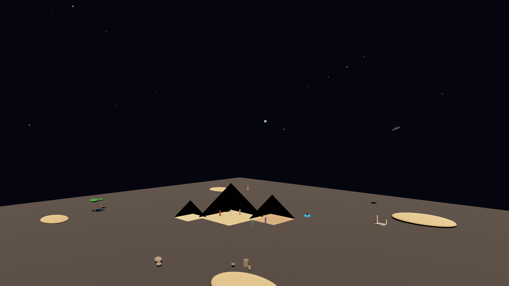

**LocalGPT Gen** v0.3.2 introduces a new concept: treating complete 3D worlds as reusable skills that agents can save, load, and share.

<!--truncate-->

`localgpt-gen` now saves complete worlds as skill directories containing:

*   **Scene geometry** — All entities, meshes, and transforms
*   **Behaviors** — Animations like orbit, spin, bob, path following
*   **Audio configuration** — Ambient soundscapes and spatial emitters

The skill folder structure:

```
skills/my-world/
├── SKILL.md          # Description and usage
├── world.ron         # World manifest with entities preserves parametric shapes
└── export/
    └── scene.glb     # glTF export (generated on demand)
```

This is inspired by [blender-mcp](https://github.com/ahujasid/blender-mcp) and [bevy_brp](https://github.com/natepiano/bevy_brp), and may shrink the software supply chain from intent to result a little bit more.

LocalGPT Gen is closer to the domain of tools for [Explorable World](/docs/worlds) like Genie 3, SIMA 2, Marble, Intangible and Artcraft.

**Showcases:**
- [localgpt-gen-workspace](https://github.com/localgpt-app/localgpt-gen-workspace) — "World as skill" examples: complete explorable worlds saved as reusable, shareable skills
- [proofof.video](https://proofof.video/) — Video gallery comparing world generations across different models using the same or similar prompts

Many players are advancing the [Claw Ecosystem](/docs/claw) so the agent memory and orchestration will improve automatically.
